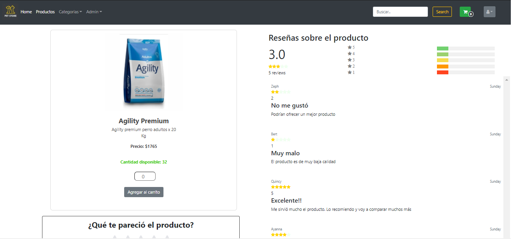
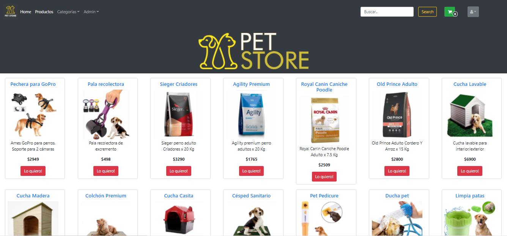
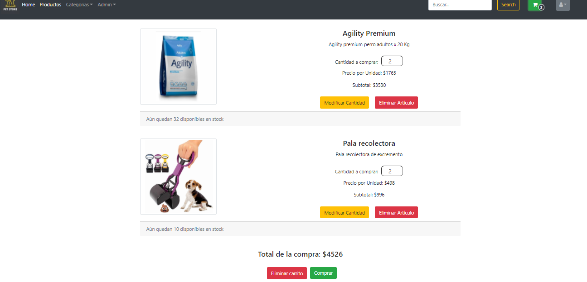
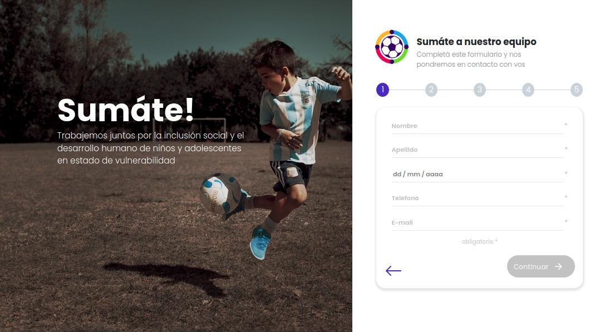
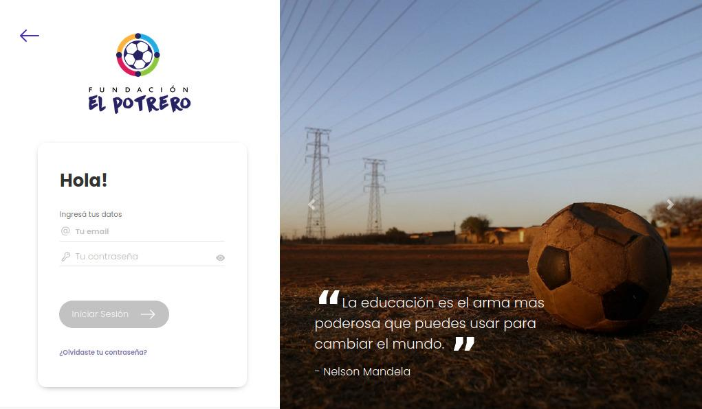
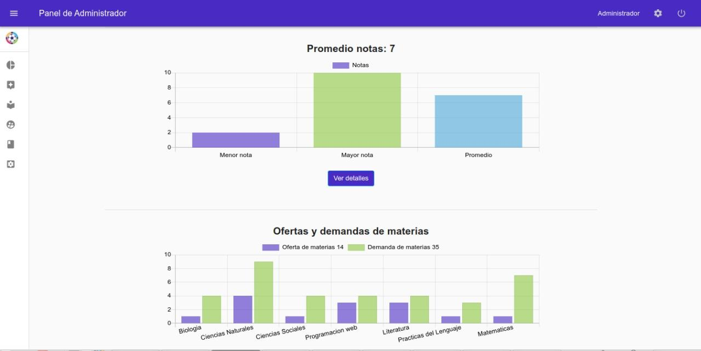

<h1 align="center">Elephants never forget</h1>

[](https://postimg.cc/wyY3m886)


******
<p align="left"> <a href="https://aws.amazon.com" target="_blank">  </a> <a href="https://babeljs.io/" target="_blank">  </a> <a href="https://getbootstrap.com" target="_blank">  </a> <a href="https://www.cprogramming.com/" target="_blank">  </a> <a href="https://www.chartjs.org" target="_blank">  </a> <a href="https://www.w3schools.com/cpp/" target="_blank">  </a> <a href="https://www.w3schools.com/css/" target="_blank">  </a> <a href="https://expressjs.com" target="_blank">  </a> <a href="https://www.figma.com/" target="_blank">  </a> <a href="https://firebase.google.com/" target="_blank">  </a> <a href="https://git-scm.com/" target="_blank">  </a> <a href="https://www.w3.org/html/" target="_blank">  </a> <a href="https://developer.mozilla.org/en-US/docs/Web/JavaScript" target="_blank">  </a> <a href="https://mochajs.org" target="_blank">  </a> <a href="https://nodejs.org" target="_blank">  </a> <a href="https://www.photoshop.com/en" target="_blank">  </a> <a href="https://www.postgresql.org" target="_blank">  </a> <a href="https://reactjs.org/" target="_blank">  </a> <a href="https://reactnative.dev/" target="_blank">  </a> <a href="https://redux.js.org" target="_blank">  </a> <a href="https://www.typescriptlang.org/" target="_blank">  </a> <a href="https://webpack.js.org" target="_blank">  </a> </p

******
 
 
<h1 align="center"> Projects </h1>


    eCommerce



    

    Fundación el Potrero



     
  ******
  
  ```javascript
        Would_You_Like_To_Contact_Me ? email(me): Would_You_Like_To_Play_Chess ? challenge(me) : continue 
  ```
  
 Me: 📫 **elefantenegro64@gmail.com**
    <a href='https://postimg.cc/hfQFkcY1' target='_blank'></a>
 
  <p align="left">
        <a href="https://linkedin.com/in/leandro-agustin-alvarez/" target="blank">LinkedIn</a>
        <a href="https://instagram.com/leandroagustinalvarez/" target="blank">Instagram</a>
        <a href="https://www.hackerrank.com/elefantenegro64" target="blank">HackeRank</a>
       </p>
       

   You wanna challenge me ? [ElefanteNegro's Lichess Profile](https://lichess.org/@/ElefanteNegro "ElefanteNegro's Lichess Profile")
